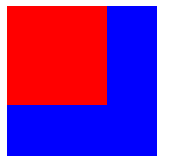

# 什么是 BFC

BFC Block Formatting Context 指块级格式上下文，是 Web 页面中盒子模型布局的 CSS 渲染模式，是块盒子布局过程发生的区域，也是浮动元素与其他元素交互的区域。

# 形成 BFC 的条件

1. 浮动元素（即 `float` 除了 `none` 以外的值）。
2. 定位元素。
3. `display: inline-block | table-cell | table-caption`。
4. `overflow: hidden | auto | scroll`。

# BFC 的特性

1. 内部盒子会在垂直方向上一个接一个的放置。
2. 垂直方向上的距离由内边距 `margin` 决定。
3. BFC 的区域不会与浮动 `float` 的区域重叠。
4. 计算 BFC 高度时，浮动元素也会参与计算。
5. BFC 也只是页面上的一个独立容器，容器里面的子元素不会影响外面元素。

# BFC 可以解决哪些问题

## 浮动子元素导致父元素高度坍塌

解决方法：给父元素开启 BFC 模式。

原理：计算 BFC 高度时，浮动子元素也参与计算。

原代码与效果：

```html
<head>
    <meta charset="UTF-8">
    <title>Title</title>
    <style>
        #fa {
            border: 10px solid palevioletred;
        }
        #son {
            float: left;
            width: 100px;
            height: 100px;
            background-color: cornflowerblue;
        }
    </style>
</head>
<body>
    <div id="fa">
        <div id="son">
        </div>
    </div>
</body>
```


给父元素添加 BFC（只需要添加一条触发 BFC 的属性即可）：

```css
#fa {
    overflow: hidden;
    border: 10px solid palevioletred;
}
```


## 非浮动元素被浮动元素覆盖

解决方法：给非浮动元素开启 BFC模式。

原理：BFC 区域不会与浮动元素重叠。

原代码与效果：

```html
<head>
    <meta charset="UTF-8">
    <title>Title</title>
    <style>
        #box1 {
            width: 100px;
            height: 100px;
            background-color: red;
            float: left;
        }
        #box2 {
            width: 150px;
            height: 150px;
            background-color: blue;
        }
    </style>
</head>
<body>
    <div id="box1"></div>
    <div id="box2"></div>
</body>
```



给非浮动元素加上 BFC 模式：

```css
#box2 {
    width: 150px;
    height: 150px;
    background-color: blue;
    overflow: hidden;
}
```


## 两栏自适应布局

解决方法：给固定栏设置固定宽度，给不固定栏开启 BFC。

原理：BFC 的区域不会与浮动元素重叠。

原本代码与效果：

```html
<head>
    <meta charset="UTF-8">
    <title>Title</title>
    <style>
        * {
            padding: 0;
            margin: 0;
        }
        #box1 {
            width: 80px;
            height: 100px;
            background-color: red;
        }
        #box2 {
            height: 100px;
            background-color: blue;
        }
    </style>
</head>
<body>
    <div id="box1"></div>
    <div id="box2"></div>
</body>
```


给固定栏添加浮动，给非固定栏添加 BFC 模式后：

```css
#box1 {
    width: 80px;
    height: 100px;
    background-color: red;
    float: left;
}
#box2 {
    height: 100px;
    background-color: blue;
    overflow: hidden;
}
```


