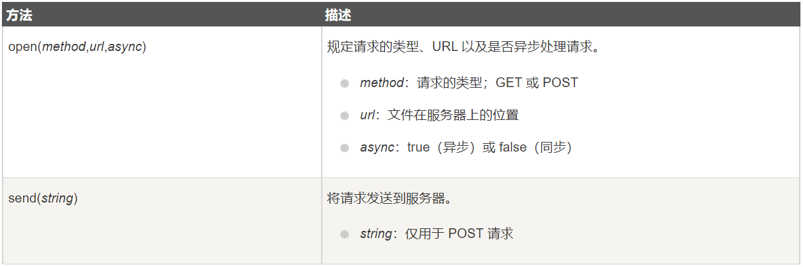
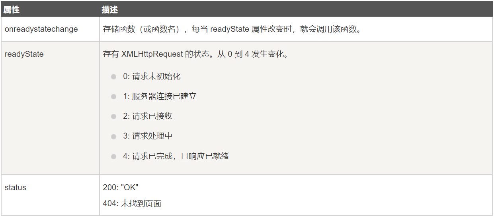

# 什么是 AJAX

Asynchronous Javascript And XML，即异步 JS 和 XML。

AJAX 是一种用于创建快速动态网页的技术，通过在后台与服务器进行少量数据交换，AJAX 可以使网页实现异步更新。这意味着可以在不重新加载整个网页的情况下，对网页的某部分进行更新。不使用 AJAX 的传统网页如果需要更新内容，必须重载整个页面。

## 工作原理


# AJAX 是基于现有的 Internet 标准

AJAX 是基于现有的 Internet 标准，并且联合使用它们：

+ XMLHttpRequest 对象（异步的与服务器交换数据）
+ JS/DOM（信息显示/交互）
+ CSS
+ XML（作为转换数据的格式）

> 因此，AJAX 应用程序与浏览器和平台无关。

# 创建 XMLHttpRequest 对象

## XMLHttpRequest 对象

所有现代浏览器都支持 XMLHttpRequest对象。XMLHttpRequest 用于在后台与服务器交换数据，这意味着可以在不重新加载整个网页的情况下，对网页的某部分进行更新。

## 创建 XMLHttpRequest 对象

所有现代浏览器均内建 XMLHttpRequest 对象。

创建 XMLHttpRequest 对象的语法格式如下：

```js
variable = new XMLHttpRequest();
```

# 向服务器发送请求

## 向服务器发送请求

如果需要将请求发送到服务器，我们将使用 XMLHttpRequest 对象的 opne() 和 send() 方法：



## GET 还是 POST

与 POST 相比，GET 更简单也更快，并且在大部分情况下都能用。但是在下列情况，POST 请求更优秀：

+ 无法使用缓存文件（更新服务器上的文件或数据库）
+ 向服务器发送大量数据（POST 没有数据量限制）
+ 发送包含未知字符的用户输入时，POST 更加稳定可靠

## GET 请求

一个简单的 GET 请求：

```js
xmlhttp.open("GET", "/try/ajax/demo_get.php", true);
xmlhttp.send();
```


在上面的例子中，可能得到的是缓存的结果。

为了避免这种情况，我们向 URL 添加一个唯一的 ID：

```js
xmlhttp.open("GET", "/try/ajax/demo_get.php?t=" + Math.random(), true);
xmlhttp.send();
```

如果希望通过 GET 方法发送信息，向 URL 添加信息：

```js
xmlhttp.open("GET", "/try/ajax/demo_get2.php?fname=Henry&lname=Ford", true);
xmlhttp.send();
```

## POST 请求

```js
xmlhttp.open("POST","/try/ajax/demo_post.php", true);
xmlhttp.send();
```

如果需要像 HTML 表单那样 POST 数据，请使用 setRequestHeader() 来添加 HTTP 头，然后在 send() 方法中规定发送的数据：

```js
xmlhttp.open("POST", "/try/ajax/demo_post2.php", true);
xmlhttp.setRequestHeader("Content-type", "application/x-www-form-urlencoded");
xmlhttp.send("fname=Henry&lname=Ford");
```


# 服务器响应

如果需要获得来自服务器的响应，需要使用 XMLHttpRequest 对象的 responseTest 或者 responseXML 属性：

+ responseText：获得字符串形式的响应数据
+ responseXML：获得 XML 形式的响应数据

## responseText 属性

可以这样使用：

```js
document.getElementById("myDiv").innerHTML = xmlhttp.responseText;
```

## responseXML 属性

使用示例如下：

```js
xmlDoc = xmlhttp.responseXML;
txt = "";
x = xmlDoc.getElementsByTagName("ARTIST");
for (let i = 0; i < x.length; i++) {
    txt = txt + x[i].childNodes[0].nodeValue + "<br>";
}
document.getElementById("myDiv").innerHTML = txt;
```


# onreadystatechange 事件

## onreadystatechange 事件

当请求被发送到服务器时，我们需要执行一些基于响应的任务。

每当 readyState 改变时，就会触发 onreadystatechaneg 事件。

readyState 属性存有 XMLHttpRequest 的状态信息。

下面是 XMLHttpRequest 对象的三个重要的属性：



使用如下：

```js
xmlhttp.onreadystatechange = function() {
    if (xmlhttp.readyState == 4 && xmlhttp.status == 200) {
        document.getElementById("myDiv").innerHTML = xmlhttp.responseText;
    }
}
```

