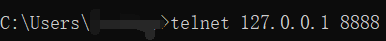
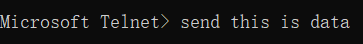
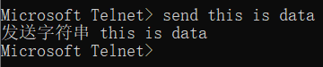
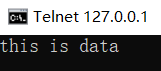

事件发射器会触发事件，并且在那些事件被触发时能处理它们。

# 事件发射器实例

下面的代码实现了一个`echo`服务器，当有客户端连接上来时，它就会创建一个`socket`。`socket`是一个事件发射器，可以用`on`方法添加监听器响应`data`事件。只要`socket`上有新数据过来，就会发出这些`data`事件。

```js
const net = require('net')

const server = net.createServer(socket => {
    socket.on('data', data => {
        socket.write(data)
    })
})

server.listen(8888)
```









# 响应第一次发送过来的数据

监听器可以被定义成连续不断地响应事件，如上面代码，也能被定义成只响应一次。下面代码使用`once`方法，对前面的`echo`服务器做了修改，让它只回应第一次发送过来的数据。

```js
const net = require('net')

const server = net.createServer(socket => {
    socket.once('data', data => {
        socket.write(data)
    })
})

server.listen(8888)
```


# 用事件发射器实现简单的发布/预定系统

下面的代码定义一个`channel`事件发射器，带有一个监听器，可以向加入频道的人做出响应。注意这里用`on`（或者用比较长的`addListener`）方法给事件发射器添加监听器，然后用`emit`函数发射这个事件：

```js
const EventEmitter = require('events').EventEmitter
const channel = new EventEmitter()
channel.on('join', () => {
    console.log('Welcome')
})
channel.emit('join')
```

接下来用`EventEmitter`实现自己的发布/预定逻辑，做一个通信通道。

```js
const events = require('events')
const net = require('net')
const channel = new events.EventEmitter()
channel.clients = {}
channel.subscriptions = {}
channel.on('join', function (id, client) {
    this.clients[id] = client
    this.subscriptions[id] = (senderId, msg) => {
        if (id != senderId) {
            this.clients[id].write(msg)
        }
    }
    this.on('broadcast', this.subscriptions[id])
})
const server = net.createServer(client => {
    const id = `${client.remoteAddress}:${client.remotePort}`
    channel.emit('join', id, client)
    client.on('data', data => {
        data = data.toString()
        channel.emit('broadcast', id, data)
    })
})
server.listen(8888)
```

运行上面代码，多打开几个命令行窗口，会发现在其中任何一个窗口输入的内容都将会被发送到其他所有窗口中。

但是这个写法会有一个问题，在用户关闭连接离开聊天室后，原来那个监听器还在，仍会尝试向已经断开的连接写数据，这样就更容易出错。
