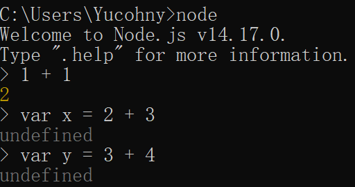

> 名词解释REPL-R(read), E(evaluate)，P(print)，L(loop)

在任意目录下打开`cmd`窗口，输入`node`直接回车，可以得到与浏览器`console`一样的效果

但是注意，有的对象在`node`中是没有的，但是在浏览器中有，比如`window`和`document`，所以我们在`node`中的`console`使用`window`或者`document`会返回`undefined`

而我们可以在`node`中使用浏览器中的`console`所没有的一些`node`内置`api`，比如`url.parse()`，此时就不需要像在源代码一样去导入核心模块`url`后再来使用`parse()`方法。

另外也需要注意，原本计算机中`cmd`命令行窗口的一些文件管理操作比如`cd`，在`node`中的`console`无法使用。

