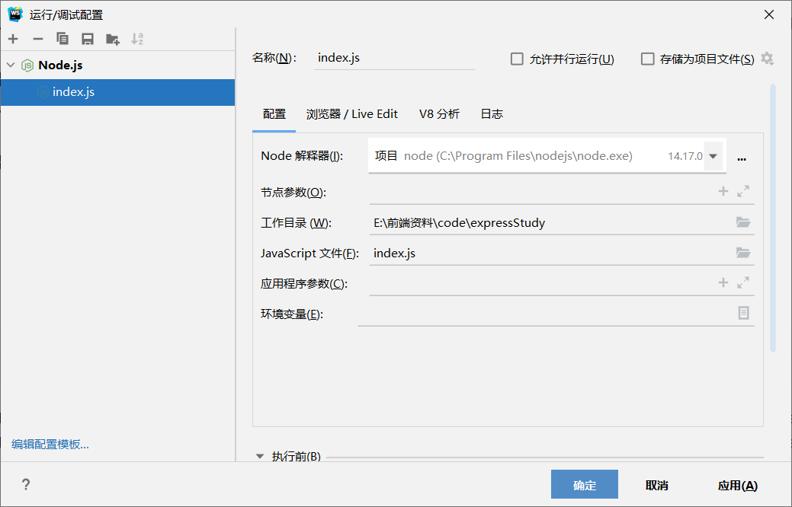
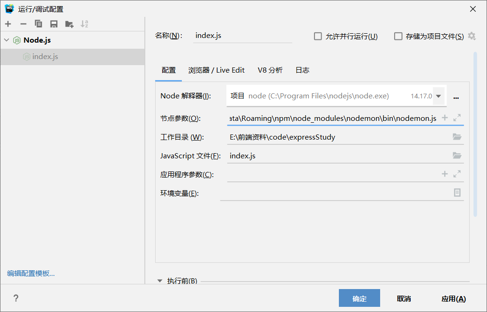

`nodemon`是一个基于`Node.js`开发的一个第三方命令行工具，可以帮助我们解决频繁修改代码重启服务器问题，需要独立安装：

```shell
npm install --global nodemon
> nodemon@2.0.13 postinstall C:\Users\Yucohny\AppData\Roaming\npm\node_modules\nodemon
> node bin/postinstall || exit 0

Love nodemon? You can now support the project via the open collective:
 > https://opencollective.com/nodemon/donate

npm WARN optional SKIPPING OPTIONAL DEPENDENCY: fsevents@~2.3.2 (node_modules\nodemon\node_modules\chokidar\node_modules\fsevents):
npm WARN notsup SKIPPING OPTIONAL DEPENDENCY: Unsupported platform for fsevents@2.3.2: wanted {"os":"darwin","arch":"any"} (current: {"os":"win32","arch":"x64"})

+ nodemon@2.0.13
added 118 packages from 53 contributors in 29.076s
```

安装完毕后，可以在命令行窗口将`node xxx.js`替换为`nodemon xxx.js`命令，以解决修改代码重启服务器问题。

也可以通过`webstorm`直接整合`nodemon`

原来的：



将下载好的`nodemon.js`加入结点参数：

