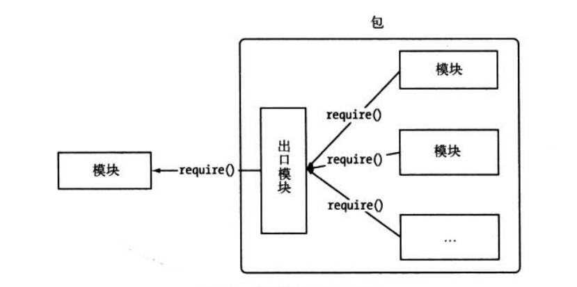

此篇笔记参考朴灵大神作品《深入浅出`Node.js`》`2.6`章节


`Node`组织了自身的核心模块，使得第三方模块可以有序编写和使用。但是第三方模块中，模块与模块之间依然是分散的，相互之间不能直接引用。而包与`NPM`则是将模块联系起来的一种机制。

`Node`对模块规范的实现，一定程度上解决了变量依赖、依赖关系等代码组织性问题。包的出现，则是在模块的基础上进一步组织`JS`代码。下图为朴灵大神书中图，包组织模块示意图：



`CommonJS`的包规范分为两个部分——包结构和包描述文件。前者用于组织包中的各种文件，后者则用于描述包的相关信息，以供外部读取分析。


# 包结构

包实际上是一个存档文件，即一个目录直接打包为`.zip`或者`tar.gz`格式的文件，安装后解压还原为目录。完全符合`CommonJS`规范的包目录应该包含如下文件：

+ `package.json`：包描述文件。
+ `bin`：用于存放可执行二进制文件的目录。
+ `lib`：用于存放`JS`代码的目录。
+ `doc`：用于存放文档的目录。
+ `test`：用于存放单元测试用例的代码。


# 包描述文件与`NPM`

`CommonJS`为`package.json`文件定义如下一些必须的字段


在包描述文件的规范中，`NPM`实际需要的字段相比包规范对了`author`、`bin`、`main`、`devDependencies`四个字段，说明如下：


# `NPM`常用功能

`CommonJS`包规范是理论，`NPM`是其中的一种实践。对于`Node`而言，`NPM`帮助完成了第三方模块的发布、安装和依赖等等。借助`NPM`，`Node`与第三方模块之间形成了很好的一个生态系统。

## 1.查看帮助

查看当前版本

`npm -v`

直接执行`NPM`查看帮助引导说明

`npm`


## 2.安装依赖包

安装依赖包是`NPM`最常见的用法，它的执行语句是`npm install xxx`（`xxx`是待安装包的名字）。执行该命令后，`NPM`会在当前目录下创建`node_modules`目录，然后在`node_modules`目录下创建`xxx`目录，接着将包解压到这个目录下。安装好依赖包后，直接在代码中调用`require('xxx')`即可引入该包。

### （1）全局模式安装？

### （2）从本地安装

对于一些没有发布的`NPM`上的包，或是因为网络原因导致无法直接安装的包，可以通过将包下载到本地，然以本地安装。

本地安装只需要为`NPM`指明`package.json`文件所在的位置即可：

它可以是一个包含`package.json`的存档文件，也可以是一个`URL`地址，也可以是一个目录下有`package.json`文件的目录位置

### （3）从非官方源安装

如果不能通过官方源安装，可以通过镜像源安装。在执行命令时，添加`--registry=http://registry.url`即可，示例如下：

`npm install express --registry=http://registy.url`

如果使用过程中经常使用镜像源安装，可以执行下面命令指定默认源：

`npm config set registry http://registry.url`

## 3.`NPM`钩子命令

`package.json`中`scripts`字段让包在安装或者卸载等过程中提供钩子机制，实例如下：

```json
"scripts": {
	"preinstall": "preinstall.js",
	"install": "install.js",
	"uninstall": "uninstall.js",
	"test": "test.js"
}
```

在以上字段中执行`npm install xxx`时，`preinstall`指向的脚本将被加载执行，然后`install`指向的脚本会被执行（注意有先后顺序）。

在执行`npm uninstall xxx`时，`uninstall`指向的脚本会执行去完成一些清理工作。

当在一个具体的包目录下执行`npm test`时，将会指向`test`指向的脚本。

## 4.发布包

为了将整个`NPM`流程串联起来，此处我们演示如何编写一个包，并将其发布到`NPM`仓库中。

### 编写模块

编写下面模块并保存在`hello.js`文件中

```js
exports.sayHello = function () {
    return 'Hello World!'
}
```

### 初始化包描述文件

`npm init`命令会帮助生成`package.json`文件，`NPM`通过提问的方式逐个填入选项，最后生成预览的包描述文件。然后输入`yes`，就可以在当前目录下得到`package.json`文件。

```cmd
E:\npm>npm init
This utility will walk you through creating a package.json file.
It only covers the most common items, and tries to guess sensible defaults.

See `npm help init` for definitive documentation on these fields
and exactly what they do.

Use `npm install <pkg>` afterwards to install a package and
save it as a dependency in the package.json file.

Press ^C at any time to quit.
package name: (npm) testnpm
version: (1.0.0) 1.0.0
description: no description
entry point: (hello.js) ./hello.js
test command:
git repository:
keywords: Hello World
author: Yucohny
license: (ISC) BSD-2-Clause
About to write to E:\npm\package.json:

{
  "name": "testnpm",
  "version": "1.0.0",
  "description": "no description",
  "main": "./hello.js",
  "scripts": {
    "test": "echo \"Error: no test specified\" && exit 1"
  },
  "keywords": [
    "Hello",
    "World"
  ],
  "author": "Yucohny",
  "license": "BSD-2-Clause"
}


Is this OK? (yes) yes

```

### 注册包仓库账号

注册账号的命令是`npm adduser`，这也是一个提问式的交互过程，顺序执行：


### 上传包

上传包的命令是`npm pubish <folder>`，在创建的`package.json`文件所在的文件下，执行`npm publish .`，开始上传包

### 管理包权限

`npm owner ls <package name>`命令用于展示当前包所属权限

`npm owner add <user> <package name>`添加拥有者

`npm owner rm <user> <package name>`删除成员

## 5.分析包

`npm ls`命令用于分析当前路径下能够通过模块路径找到的所有包。


# 局域`NPM`


# `NPM`潜在问题


