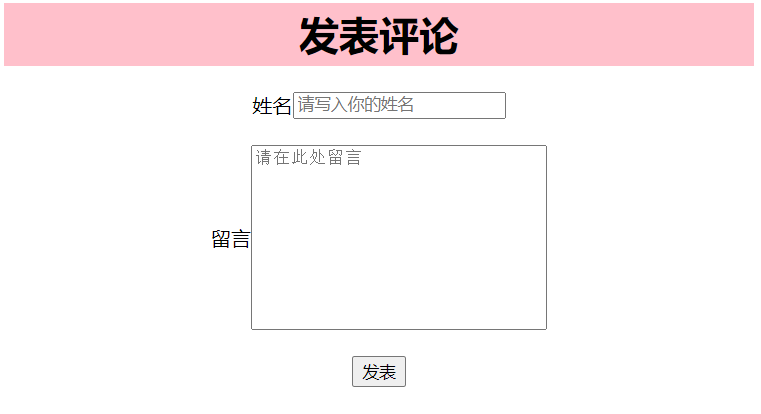
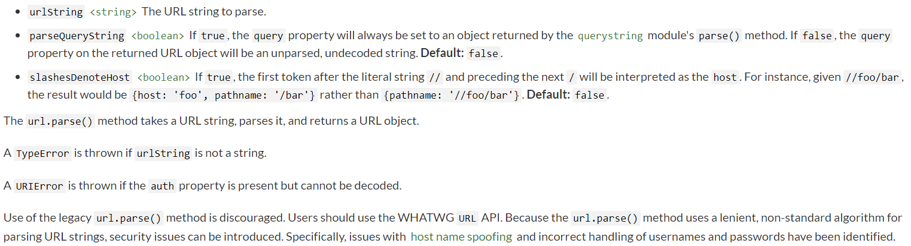

这篇笔记用于记录如何将客户端的表单数据发送至服务端。

# 创立表单

在`html`文件中创建文件`index.html`，并创建一个表单（样式见源代码）：

```html
<body>
    <div class="box">
        <div class="header">
            <h1>发表评论</h1>
        </div>
        <div class="container">
            <form action="/comment" method="get">
                <br>
                <div class="form-group">
                    <label for="input_name">姓名</label>
                    <input type="text" class="form-control" required="" minlength="2" maxlength="10" id="input_name" name="name"
                           placeholder="请写入你的姓名">
                </div>
                <br>
                <div class="form-group">
                    <label for="textarea_message">留言</label>
                    <textarea class="form-control" name="message" id="textarea_message" cols="30" rows="10" required=""
                              minlength="5" maxlength="20" placeholder="请在此处留言"></textarea>
                </div>
                <br>
                <button type="submit" class="btn btn-default">发表</button>
            </form>
        </div>
    </div>
</body>
```

效果如下：




注意，此处我将表单`form`的响应写为了`comment`，并且两条信息的`name`属性分别`name`和`message`。

假定我们分别填写了`Yucohny`和`My name is Yucohny.`，那么在我们点击提交后会跳转至`url`为`/comment?name=Yucohny&message=My+name+is+Yucohny.`的页面。

接下来的思路便是利用这个`url`来获取我们所想要的`name`与`message`信息。

# `url`核心模块之`parse`函数

接下来我们介绍一下`url`核心模块。

顾名思义，`url`这个核心模块自然是用于处理当前`request`的`url`信息。

我们在[官方文档](https://nodejs.org/dist/latest-v16.x/docs/api/url.html#url_url_parse_urlstring_parsequerystring_slashesdenotehost)找到对`url.parse(urlString[, parseQueryString[, slashesDenoteHost]])`方法的说明，如下



单词`parse`的意思就是“对句子作句法分析/语法分析”。

我们关注前两个函数参数

`urlString`，就是我们的`url`字符串

`parseQueryString`，一个`boolean`对象，如果为`true`，那么`query`这个属性就会返回一个已经分析过`url`句法的对象；如果为`false`就直接返回`url`中的信息字符串，默认为`false`。

接下来我们对第二个属性作一个对比：

第二个参数为`false`:

```js
var url = require('url')
console.log(url.parse('/comment?name=Yucohny&msg=Weekend'))
```

控制台输出：

```js
Url {
  protocol: null,
  slashes: null,
  auth: null,
  host: null,
  port: null,
  hostname: null,
  hash: null,
  search: '?name=Yucohny&msg=Weekend',
  query: 'name=Yucohny&msg=Weekend',
  pathname: '/comment',
  path: '/comment?name=Yucohny&msg=Weekend',
  href: '/comment?name=Yucohny&msg=Weekend'
}
```

第二个参数为`true`:

```js
var url = require('url')
console.log(url.parse('/comment?name=Yucohny&msg=Weekend', true))
```

控制台输出：

```js
Url {
  protocol: null,
  slashes: null,
  auth: null,
  host: null,
  port: null,
  hostname: null,
  hash: null,
  search: '?name=Yucohny&msg=Weekend',
  query: [Object: null prototype] { name: 'Yucohny', msg: 'Weekend' },
  pathname: '/comment',
  path: '/comment?name=Yucohny&msg=Weekend',
  href: '/comment?name=Yucohny&msg=Weekend'
}
```

对比`query`属性，我们发现在第二个参数为`true`时，已经将`url`中的信息进行了分析并且将内容以对象的形式返回。

那么此时我们就在服务端可以通过调用属性的方式获取到客户端表单中所提交的信息了。

# 完整代码见文件夹

