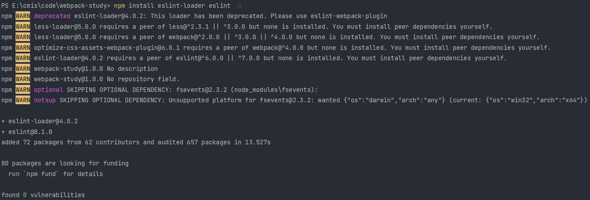
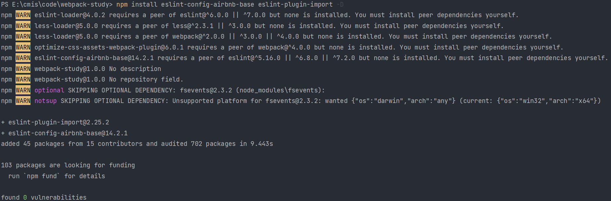
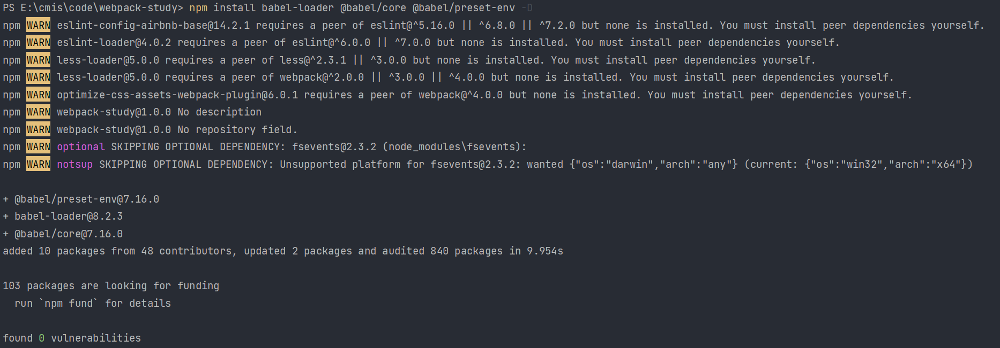

# 基本使用

ESLint 是一个用来识别 ECMAScript / JavaScript 并且按照规则给出报告的代码检测工具

在 webpack 中，我们使用库 eslint-loader 来进行语法检查，但是由于 eslint-loader 又依赖于库 eslint，因此我们需要将两个库都安装上：



然后我们在 package.json 中属性 eslintConfig 设置 airbnb 规则。要设置 airbnb 规则，首先需要安装 eslint eslint-config-airbnb-base eslint-plugin-import 这三个库：



配置：

```json
"eslintConfig": {
  "extends": "airbnb-base"
}
```

注意：我们只需要检查自己写的源代码，不用去检查第三方库，因此我们需要排除 node_modules 中的代码。

```js
module: {
    rules: [
        {
            test: /\.js$/,
            exclude: /node_modules/,
            loader: 'eslint-loader',
            options: {
            }
        }
    ]
}
```

我们可以在 options 中设置 fix: true 属性，这样当运行 webpack 进行 ESLint 检查时，若发现了不符合要求的格式时会自动修复。

若想要部分进行 ESLint 检查，我们可以在代码中加入一行 // eslint-disable-next-line ，即从下一行开始 ESLint 的所有规则都失效。

# js 兼容性处理

## 基本兼容

为什么需要进行兼容性处理？有的浏览器不支持 ES6 语法，因此在无法识别部分打包后的语句（没错说的就是 IE）。

js 兼容性处理需要使用 babel-loader @babel/core 和 @babel/preset-env 库：



配置如下：

```js
module: {
    rules: [
        {
            test: /\.js$/,
            exclude: /node_modules/,
            loader: 'babel-loader',
            options: {
                presets: ['@babel/preset-env']
            }
        }
    ]
}
```

上述代码主要通过 @babel/preset-env 完成了基本的 js 兼容性处理，比如基本语法。

## 全部兼容

如果想要完成更多的 js 兼容性处理，比如 Promise 对象，还需要 @babel/polyfill 库。

如果想要引入 @babel/polyfill 库，我们只需要在 js 源代码中引入即可：import '@babel/polyfill'。

问题：当我只需要解决部分兼容性问题时，如果将所有的兼容性代码引入，则会导致不必要的效率损耗。

## 部分兼容

即按需加载。

此时我们需要 core-js 库。

配置修改如下：

```js
presets: [
    '@babel/preset-env',
    {
        useBuiltIns: 'usage',
        corejs: {
            version: 3
        },
        targets: {
            chrome: '60',
            firefox: '60',
            ie: '9',
            safari: '10',
            edge: '17'
        }
    }
]
```

注意：当使用部分兼容时，需要将源代码中引入的 @babel/polyfill 删除。

> 当对 js 进行兼容性处理后，我们可以发现输出的 js 文件更大了，因为有更多的内容要进行兼容性处理。
>
> 这在兼容多少中有明显的体现。

