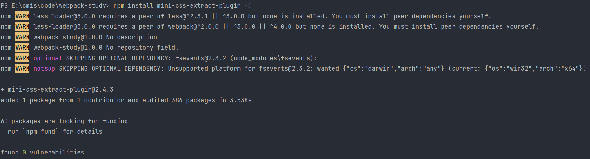
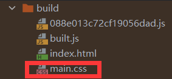
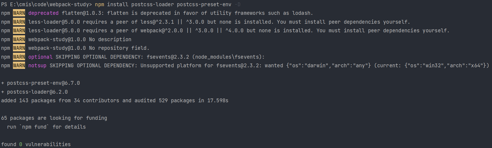
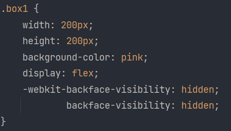
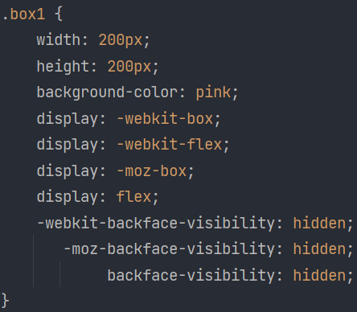
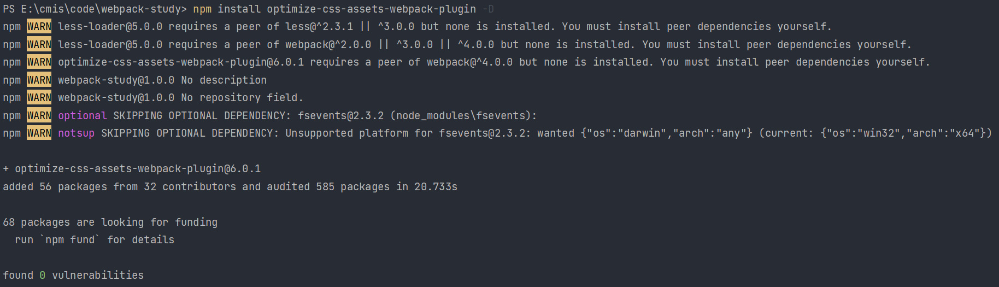
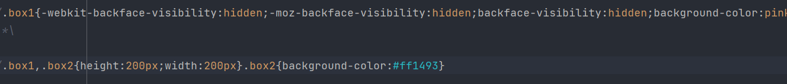

# 提取 css 成单独文件

首先需要安装包：

```shell
npm install mini-css-extract-plugin -D
```



安装完毕后，和 html-webpack-plugin 这个插件一样，首先在入口文件中引入：

```js
const MiniCssExtractPlugin = require('mini-css-extract-plugin')
```

随后在 plugin 属性中引入，再用 MiniCssExtractPlugin.loader 替换 style.loader，用于提取 js 中的 css 文件

```js
const { resolve } = require('path')
const HtmlWebpackPlugin = require('html-webpack-plugin')
const MiniCssExtractPlugin = require('mini-css-extract-plugin')
const path = require("path");
module.exports = {
    entry: './src/index.js',
    output: {
        filename: 'built.js',
        path: resolve(__dirname, 'build')
    },
    module: {
        rules: [
            {
                test: /\.css$/,
                use: [
                    MiniCssExtractPlugin.loader,
                    'css-loader'
                ]
            },
            {
                test: /\.html$/,
                loader: 'html-loader'
            }
        ]
    },
    plugins: [
        new HtmlWebpackPlugin({
            template: "./src/index.html"
        }),
        new MiniCssExtractPlugin()
    ],
    mode: 'development',
    devServer: {
        static: {
            directory: path.join(__dirname, 'build')
        },
        compress: true,
        port: 3000,
        open: true
    }
}
```

此时运行后，即可在输出目录中看到提取为单独文件的 css 了。



并且在输出的 index.html 中，可以看到引入了当前样式资源。

# css 兼容性处理

我们需要这两个库：postcss-loader postcss-preset-env

postcss-preset-env 用于帮 postcss-loader 找到 package.json 中 browserslist 里面的配置，通过配置加载指定的 css 兼容性样式



package.json 增加配置如下：

```json
{
    "browserslist": {
        "development": [
            "last 1 chrome version",
            "last 1 firefox version",
            "last 1 safari version"
        ],
            "production": [
            ">0.2%",
            "not dead",
            "not op_mini all"
        ]
    }
}
```

该配置默认为生产环境，如果需要指定为开发环境，需要设置 node 环境变量：
process.env.NODE_ENV = 'development'

loader 修改如下，首先在根目录下新建 postcss.config.js 文件，内容如下：

```js
module.exports = {
    plugins: [
        require('postcss-preset-env')()
    ]
}
```

随后将 loader 配置修改如下：

```js
module: {
    rules: [
        {
            test: /\.css$/,
            use: [
                MiniCssExtractPlugin.loader,
                'css-loader',
                {
                    loader: 'postcss-loader',
                }
            ]
        },
        {
            test: /\.html$/,
            loader: 'html-loader'
        }
    ]
}
```

此时再运行 webpack 进行打包，就可以在输出的 css 文件中看到兼容后的样式了：



下图为生产环境下的运行结果（注释掉 process.env.NODE_ENV = 'development' 即可）：



# 压缩 css

需要库 optimize-css-assets-webpack-plugin



在最开始引入库：

```js
const OptimizeCssAssetsWebpackPlugin = require('optimize-css-assets-webpack-plugin')
```

然后正常载入插件即可（此处不演示），webpack 运行后效果如下：



## 压缩有什么好处？

最直接的体现是 css 文件的空间减小了，从而可以更快加载相关资源。