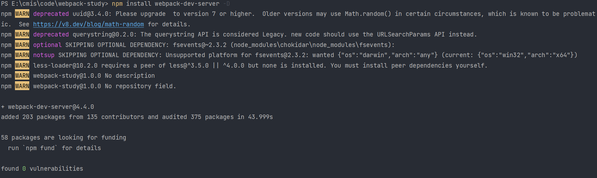
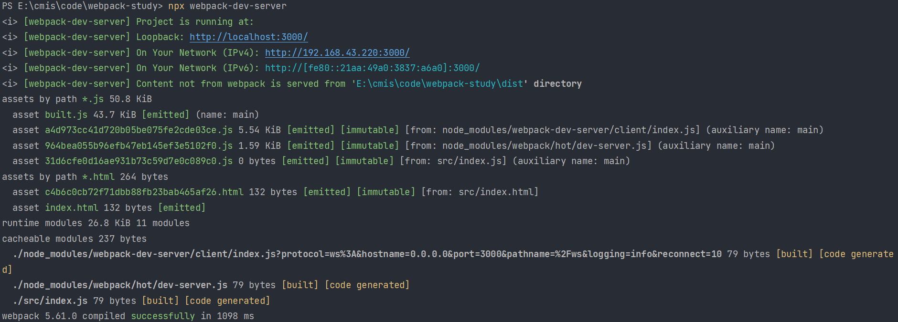

# devServer

devServer 用来自动化（自动编译，自动打开浏览器，自动刷新浏览器）

特点：只会在内存中编译打包，不会有任何输出

启动 devServer 指令为：webpack-dev-server

安装：

```shell
npm install webpack-dev-server -D
```



配置：

```js
const { resolve } = require('path')

module.exports = {
    devServer: {
        contentBase: resolve(__dirname, 'build'),
        compress: true,
        port: 3000,
        open: true
    }
}
```

运行：

```shell
npx webpack-dev-server
```



# 配置开发环境

## 配置

配置开发环境主要就是指将各类打包资源与 devServer 整合在一起。

如果对应资源也想要在 build 目录下的特定目录中输出，那就再 rules 中属性对应指定 outputPath

```js
const { resolve } = require('path')
const HtmlWebpackPlugin = require('html-webpack-plugin')
const path = require("path");
module.exports = {
    entry: './src/index.js',
    output: {
        filename: 'built.js',
        path: resolve(__dirname, 'build')
    },
    module: {
        rules: [
            //配置loader
            {
                //处理css资源
                test: /\.css$/,
                use: [
                    'style-loader',
                    'css-loader'
                ]
            },
            {
                //处理less资源
                test: /\.less$/,
                use: [
                    'style-loader',
                    'css-loader',
                    'less-loader'
                ]
            },
            {
                //处理css中的图片资源
                test: /\.(jpg|png|gif)$/,
                loader: 'url-loader',
                options: {
                    limit: 8 * 1024,
                    name: '[hash: 10].[ext]',
                    //关闭ES6模块化
                    esModule: false
                }
            },
            {
                //处理html中的图片资源
                test: /\.html$/,
                loader: 'html-loader'
            },
            {
                exclude: /\.(html|js|css|less|jpg|png|gif)$/,
                loader: "file-loader",
                options: {
                    name: '[hash: 10].[ext]'
                }
            }
        ]
    },
    plugins: [
        new HtmlWebpackPlugin({
            template: "./src/index.html"
        })
    ],
    mode: 'development',
    devServer: {
        static: {
            directory: path.join(__dirname, 'build')
        },
        compress: true,
        port: 3000,
        open: true
    }
}
```

## 不同运行指令

webpack : 运行打包，会有输出结果

npx webpack-dev-server : 开启 devServer 运行，但是不会有输出结果