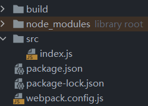
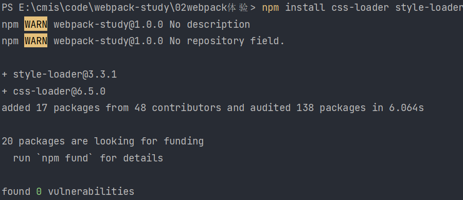
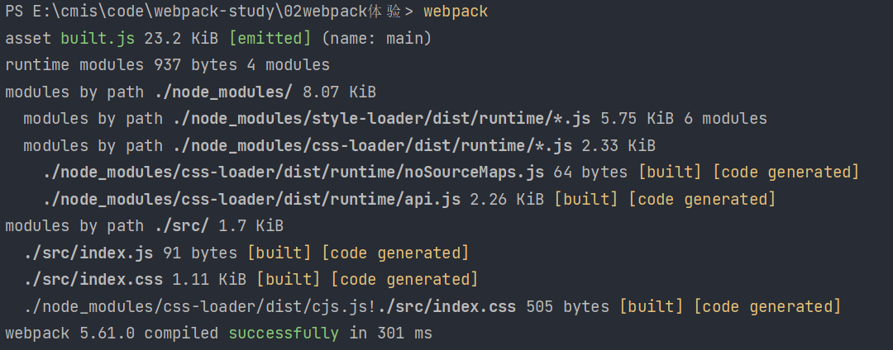
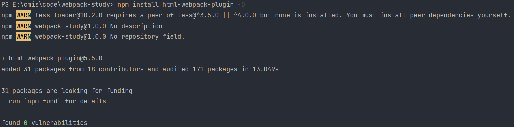

> webpack 可以**直接处理** js json 资源，但是不能**直接处理** css img 等其他资源

# 打包样式资源

如果想要 webpack 处理资源，首先要进行配置。

在根目录下创建 webpack.config.js 文件，作为 webpack 的配置文件。当运行 webpack 指令时，会加载里面的配置。

所有的构建工具都是基于 node.js 平台运行，因此模块化默认采用了 CommonJS。



创建好配置项目文件后，将五个核心概念对应的熟悉添加进去：

```js
const { resolve } = require('path')
module.exports = {
    entry: './src/index.js',
    output: {
        filename: 'built.js',
        path: resolve(__dirname, 'build')
    },
    module: {
        rules: [
        ]
    },
    plugins: [
    ],
    mode: 'development'
}
```

> resolve 此处用于拼接绝对路径，__dirname 是 node.js 中的变量，代表当前文件的目录绝对路径

我们在 module 属性中的 rules 数组中添加对象，用来匹配 css 样式文件：

```js
module: {
    rules: [
        {
            test: /\.css$/,
            use: [
                'style-loader',
                'css-loader'
            ]
        }
    ]
}
```

> test 属性用于匹配文件类型
>
> use 属性表示匹配成功后使用哪些 loader 进行处理，use 数组中 loader 执行顺序：从右到左，从下到上依次执行
>
> ​	css-loader: 将 css 文件变成 CommonJS 模块加载到 js 中，里面的内容是样式字符串
>
> ​	style-loader: 创建 style 标签，将 js 中的样式资源插入并添加到 head 中生效

运行前先下载 css-loader 和 style-loader

```shell
npm install css-loader style-loader
```



然后可以直接 webpack 打包：



解析 less 资源：

```js
module: {
    rules: [
        {
            test: /\.less$/,
            use: [
                'style-loader',
                'css-loader',
                'less-loader'
            ]
        }
    ]
}
```

# 打包 html 资源

下载插件：

```shell
npm install html-webpack-plugin -D
```



然后引入第三方库，并在配置中新建实例。

功能：默认创建一个空 HTML，自动引入打包输出的所有资源

需求：需要有结构的 HTML 文件

```js
const { resolve } = require('path')
const HtmlWebpackPlugin = require('html-webpack-plugin')
module.exports = {
    entry: './src/index.js',
    output: {
        filename: 'built.js',
        path: resolve(__dirname, 'build')
    },
    module: {
        rules: [
            {
                test: /\.css$/,
                use: [
                    'style-loader',
                    'css-loader'
                ]
            },
            {
                test: /\.less$/,
                use: [
                    'style-loader',
                    'css-loader',
                    'less-loader'
                ]
            }
        ]
    },
    plugins: [
        new HtmlWebpackPlugin({
            template: "./src/index.html"
        })
    ],
    mode: 'development'
}
```

> template 语句的含义是复制 './src/index.html' 文件，并自动引入打包输出的所有资源（JS / CSS）

# 打包图片资源

其中一个使用场景是，当在 css / less 资源中引入了图片资源，此时仍然按照原本的 css / less 打包资源的方式是会失效的，因此我们需要专门对图片进行打包。

```js
const { resolve } = require('path')
const HtmlWebpackPlugin = require('html-webpack-plugin')
module.exports = {
    entry: './src/index.js',
    output: {
        filename: 'built.js',
        path: resolve(__dirname, 'build')
    },
    module: {
        rules: [
            {
                test: /\.css$/,
                use: [
                    'style-loader',
                    'css-loader'
                ]
            },
            {
                test: /\.less$/,
                use: [
                    'style-loader',
                    'css-loader',
                    'less-loader'
                ]
            },
            {
                test: /\.(jpg|png|gif)$/,
                loader: 'url-loader',
                options: {
                    limit: 8 * 1024
                }
            }
        ]
    },
    plugins: [
        new HtmlWebpackPlugin({
            template: "./src/index.html"
        })
    ],
    mode: 'development'
}
```

注意：

+ 当依赖包有多个时，加入 use 数组；当依赖包只有一个时，我们可以直接指定 loader: 'url-loader'。
+ 尽管我们只是直接使用了 url-loader 这一个包，但是由于 url-loader 依赖于 file-loader，因此我们需要安装这两个包。
+ limit 属性用于对资源大小进行限制，比如 8 * 1024，即表示当图片大小小于 8kb 时，就会被 base64 处理
  + 优点：减少请求数量（减轻服务器压力）
  + 缺点：图片体积会更大（文件请求速度更慢）

上述做法存在的问题是，默认是无法处理 html 中的图片，因此我们需要继续设置 rules。

```js
module: {
    rules: [
        {
            test: /\.css$/,
            use: [
                'style-loader',
                'css-loader'
            ]
        },
        {
            test: /\.less$/,
            use: [
                'style-loader',
                'css-loader',
                'less-loader'
            ]
        },
        {
            test: /\.(jpg|png|gif)$/,
            loader: 'url-loader',
            options: {
                limit: 8 * 1024
            }
        },
        {
            test: /\.html$/,
            loader: 'html-loader'
        }
    ]
}
```

> html-loader 不是用来处理 html 资源，而是处理 html 文件中的 img 图片：负责引入 img，从而能被 url-loader 处理。

但是上述做法仍然存在一个问题，url-loader 默认使用 ES6 模块化解析，但是 html-loader 引入图片是 CommonJS，从而造成 [object Module] 的问题。

解决方式是关闭 url-loader 的 ES6 模块化，使用 CommonJS 解析：

```js
options: {
    limit: 8 * 1024,
    esModule: false
}
```

此时打开打包后生成的 index.html 文件，我们会发现 html 中引入的 img 文件名被修改，我们可以进行重命名：

```js
options: {
    limit: 8 * 1024,
    esModule: false,
    name: '[hash: 10].[ext]'
}
```

> [hash: 10] 取图片 hash 值的前 10 位
>
> [ext] 保留原扩展名

# 打包其他资源

```js
module: {
    rules: [
        {
            test: /\.(css|js|html)$/,
            loader: "file-loader"
        }
    ]
}
```

