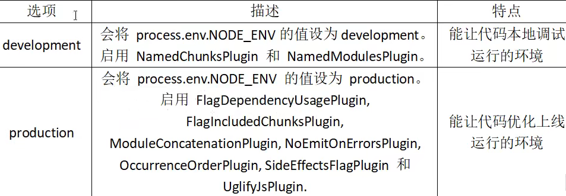
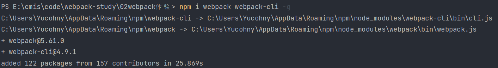
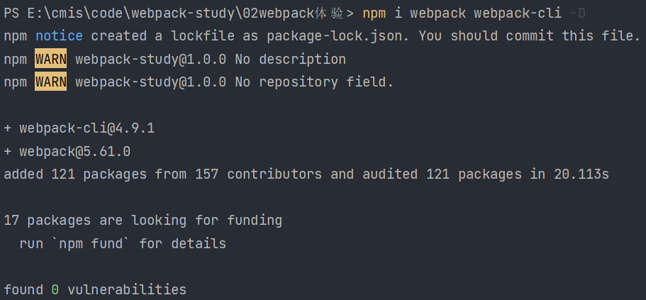
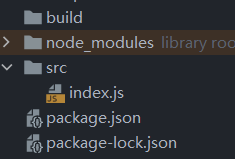
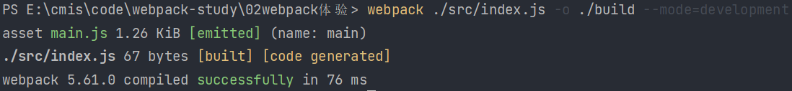
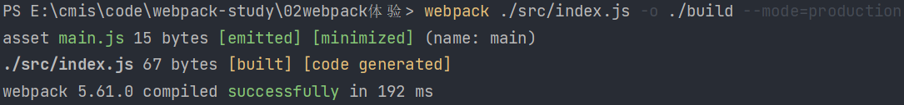

# `Webpack`是什么

`Webpack`是一种前端资源构建工具，一个静态模块打包器（`module bundler`）。

对于`Webpack`，前端的所有资源文件都会作为模块处理。它将根据模块的依赖关系进行静态分析，打包生成对应的静态资源（`bundle`）

# 核心概念

+ 入口（`Entry`）

`Entry`指示`Webpack`以哪个文件为入口起点开始阿宝，分析构建内部依赖图。

+ 输出（`Output`）

`Output`指示`Webpack`打包后的资源`bundles`输出到哪里去，以及如何命名。

+ 装载（`Loader`）

`Loader`让`Webpack`能够去处理那些非`JavaScript`文件（`Webpack`自身只理解`JavaScript`）

+ 插件（`Plugins`）

`Plugins`可以用于执行范围更广的任务。插件用途的范围包括：打包优化和压缩、重新定义环境中的变量等等。

+ 模式（`Mode`）

`Mode`指示`Webpack`使用相应模式的配置。



# 安装与基本使用

首先进行全局安装：

```shell
npm install webpack webpack-cli -g
```



然后在项目的目录下安装：

```shell
npm install webpack webpack-cli -D
```



在根目录下创建 src 目录，并在 src 目录下创建 index.js 文件作为入口文件，

在根目录下创建 build 目录，作为输出文件的存放目录



使用运行指令开始打包：

+ 开发环境下打包：

```shell
webpack ./src/index.js -o ./build --mode=development
```

webpack 会运行 ./src/index.js 下的文件，将其打包并将结果输出到 ./build 中；且将开发环境作为打包环境，运行结果如下：



同时生成打包文件：


+ 生产环境下打包

```shell
webpack ./src/index.js -o ./build --mode=production
```



> webpack 可以直接处理 js json 资源，但是不能直接处理 css img 等其他资源
>
> 生产环境和开发环境将 ES6 模块化编译成浏览器能识别的模块化
>
> 生产环境比开发环境多一个压缩 js 代码

