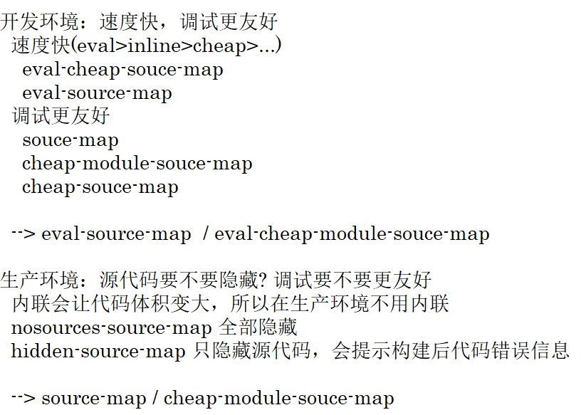

优化什么？

+ 开发环境性能优化
  + 优化打包构建速度
  + 优化代码调试
+ 生产环境性能优化
  + 优化打包构建速度
  + 优化代码运行的性能

# HMR

原本存在的问题：只是修改了其中的一个模块，但是所有的模块都会被重新打包。

hot module replacement 热模块替换

作用：一个模块发生变化，只会重新打包这一个模块，而不是打包所有模块，极大提升了构建速度

开启 HMR 功能只需要在 devServer 属性中添加 hot: true 即可：

```js
devServer: {
    static: {
        directory: path.join(__dirname, 'build')
    },
    compress: true,
        port: 3000,
        open: true,
        hot: true
}
```

但是不同的模块资源对 HMR 的适应性不同：

+ 样式文件
  + 可以使用 HMR 功能，因为 style-loader 内部实现了
+ js 文件
  + 默认不能使用 HMR 功能
+ html 文件
  + 默认不能使用 HMR 功能，同时会导致 html 资源无法进行热更新
  + 解决方案：将 index.html 也作为入口文件加入 entry

由于只有一个 html 文件，因此我们不需要对 html 文件实现 HMR功能；而要对 js 文件实现 HMR 功能，就需要修改 js 代码，添加支持 HMR 的代码。

在 index.js 中添加以下内容，即可监听 demo.js 文件的变化，一旦发生变化，其他模块不会重新打包构建，只会重新打包该资源，并执行后面的回调函数：

```js
if (module.hot) {
    module.hot.accept('./demo.js', function () {
        console.log('repacked...')
    })
}
```

> 注意：HMR 功能对 js 的处理，只能处理非入口的 js 资源。而如果修改了入口文件的 js 资源，则需要重新启动项目。

# source-map

source-map 是一种提供源代码到构建后代码映射的技术。如果构建后代码出错，则可以通过映射关系追踪到源代码何处出错。

在 webpack.config.js 中加入配置 devtool: 'source-map'

相关参数选项：

\[inline-|hidden-|eval|][noresources-]\[cheap-[module-]]source-map

+ source-map
  + 错误代码准确信息 和 源代码的错误位置

+ inline-source-map
  + 内联，只生成一个内联 source-map
  + 错误代码准确信息 和 源代码的错误位置
+ hidden-source-map
  + 外部
  + 错误代码错误原因，但是没有错误位置
  + 不能追踪源代码错误，只能提示到构建后代码的错误位置
+ eval-source-map
  + 内联，每一个文件都生成对应的 source-map，都在 eval
  + 错误代码准确信息 和 源代码的错误位置

> 内联和外部的区别：
>
> + 外部生成了文件，内联没有
> + 内联构建速度更快

+ noresources-source-map
  + 外部
  + 错误代码准确信息, 但是没有任何源代码信息
+ cheap-source-map
  + 外部
  + 错误代码准确信息 和 源代码的错误位置 
  + 只能精确的行
+ cheap-module-source-map
  + 外部
  + 错误代码准确信息 和 源代码的错误位置 
  + module 会将 loader 的 source map 加入

> 对比：

# oneOf

在 rules 属性的数组中，放置一个对象，该对象元素中设置 oneOf 对象，值为数组，我们将配置的 loader 放入该数组后，数组中的 loader 只会匹配一个。

但是要注意：不能有两个 loader 对应同一个资源文件。

此时，生产环境的配置文件内容如下：

```js
const { resolve } = require('path')
const HtmlWebpackPlugin = require('html-webpack-plugin')
const MiniCssExtractPlugin = require('mini-css-extract-plugin')
const OptimizeCssAssetsWebpackPlugin = require('optimize-css-assets-webpack-plugin')

const path = require("path");

const commonCssLoader = [
    MiniCssExtractPlugin.loader,
    'css-loader',
    {
        loader: 'postcss-loader',
    },
]

module.exports = {
    entry: './src/index.js',
    output: {
        filename: 'js/built.js',
        path: resolve(__dirname, 'build')
    },
    module: {
        rules: [
            {
                test: /\.js$/,
                exclude: /node_modules/,
                loader: 'eslint-loader',
                options: {
                    fix: true
                },
                enforce: 'pre'
            },
            {
                oneOf: [
                    {
                        test: /\.js$/,
                        exclude: /node_modules/,
                        loader: 'babel-loader',
                        options: {
                            presets: [
                                '@babel/preset-env',
                                {
                                    useBuiltIns: 'usage',
                                    corejs: {
                                        version: 3
                                    },
                                    targets: {
                                        chrome: '60',
                                        firefox: '60',
                                        ie: '9',
                                        safari: '10',
                                        edge: '17'
                                    }
                                }
                            ]
                        }
                    },
                    {
                        test: /\.css$/,
                        use: [...commonCssLoader]
                    },
                    {
                        test: /\.less$/,
                        use: [...commonCssLoader, 'less-loader']
                    },
                    {
                        test: /\.(jpg|png|gif)$/,
                        loader: 'url-loader',
                        options: {
                            limit: 8 * 1024,
                            name: '[hash: 10].[ext]',
                            esModule: false
                        }
                    },
                    {
                        test: /\.html$/,
                        loader: 'html-loader'
                    },
                    {
                        exclude: /\.(html|js|css|less|jpg|png|gif)$/,
                        loader: "file-loader",
                        options: {
                            name: '[hash: 10].[ext]'
                        }
                    }
                ]
            }
        ]
    },
    plugins: [
        new HtmlWebpackPlugin({
            template: "./src/index.html",
            minify: {
                collapseWhitespace: true,
                removeComments: true
            }
        }),
        new MiniCssExtractPlugin({
            filename: 'css/built.css'
        }),
        new OptimizeCssAssetsWebpackPlugin()
    ],
    mode: 'production',
}
```

# 缓存

## babel 缓存

只需要在 js 的配置 options 中添加属性：cacheDirectory: true 即可：

```js
module.exports = {
    module: {
        rules: [
            {
                //JS兼容
                test: /\.js$/,
                exclude: /node_modules/,
                loader: 'babel-loader',
                options: {
                    presets: [ ... ],
                    cacheDirectory: true
                }
            }
        ]
    }
}
```

加入该属性后，开始第二次构建时，就会读取之前的缓存。

## 文件资源缓存

+ hash 值修改
  + 每次打包构建时，都会生成唯一的一个 hash 值。
  + 问题：由于 js 和 css 使用的是同一个 hash 值，如果重新打包，会导致所有缓存失效（但是其实只改动了一个文件）。
+ chunkhash 值修改
  + 根据 chunk 生成的 hash 值。如果打包来源于同一个 chunk，那么 hash 值就一样。
  + 问题：js 和 css 的 hash 值还是一样的，因为 css 是在 js 中被引入的，所以同属于一个 chunk。
+ contenthash
  + 根据文件的内容生成 hash 值，不同文件的 hash 值一定不一样

# tree shaking

tree shaking 的作用是去除无用代码。

前提：

1. 必须使用 ES6 模块化
2. 开启 production 环境

作用：减小代码体积

如果在 package.json 中配置 "sideEffects": false 则可能会把 css / @babel/polyfill 文件去除；可以这样配置： "sideEffects": ["*.css", "\*.less"]

# code split

Webpack 会将所有的依赖文件打包到一个文件中，即指定的输出文件，但当一个项目慢慢变得复杂的时候会导致这个输出文件越来越大，浏览器加载的速度也会越来越慢，可以使用代码分割来将不同代码单独打包成不同文件。

## 多入口

将单入口改为多入口即可。

## 配置 optimization 属性

通过 optimization 属性将公共代码单独打包

该方式可以将 node_modules 中代码单独打包一个 chunk 最终输出。会自动分析多入口 chunk 中，有没有公共的文件，如果有会将公共文件打包成一个单独的 chunk。该方式可以对单入口文件使用，也可以对多入口文件使用。

```js
module.exports = {
    ...
    optimization: {
        splitChunks: {
            chunks: 'all',
        },
        runtimeChunk: {
	    name: entrypoint => `runtime-${entrypoint.name}`
	},
    }
}
```

# 懒加载和预加载

一般的 import 加载可以认为是并行加载，在同一时间加载多个文件。

懒加载：当文件需要使用时才加载。

例：

```js
document.getElementById('btn').onclick = funtion() {
    import(/*webpackChunkName: 'demo'*/'./demo')
    	.then({ mul } => {
        	console.log(mul(1, 2))
    	})
}
```

预加载：在使用之前提前加载好 js 文件，等其他资源加载好之后，当浏览器空闲时，再加载资源。

```js
document.getElementById('btn').onclick = funtion() {
    import(/*webpackChunkName: 'demo', webpackPrefetch: true*/'./demo')
    	.then({ mul } => {
        	console.log(mul(1, 2))
    	})
}
```

